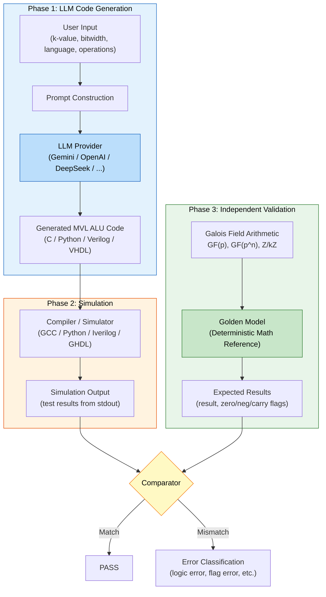

# MVL Benchmark Validation Pipeline

## Architecture Overview

The validation pipeline consists of **two completely independent components**:

1. **LLM-based Code Generation** — generates MVL ALU implementations
2. **Deterministic Golden Model Validation** — mathematically verifies correctness post-simulation

The Golden Model is a **standalone mathematical reference** with no dependency on any LLM. It computes expected results using Galois Field arithmetic (GF(p), GF(p^n)) or modular arithmetic (Z/kZ), serving as the ground truth for validation.

## Pipeline Flowchart



## Key Point: Independence

```
┌─────────────────────────┐     ┌─────────────────────────────┐
│   LLM (Black Box)       │     │   Golden Model (White Box)  │
│                         │     │                             │
│  - Non-deterministic    │     │  - Fully deterministic      │
│  - Prompt-dependent     │     │  - Math-based (GF algebra)  │
│  - Provider-variable    │     │  - No LLM dependency        │
│  - Generates code       │     │  - Computes ground truth    │
│                         │     │                             │
│  Output: ALU code       │     │  Output: Expected values    │
└──────────┬──────────────┘     └──────────────┬──────────────┘
           │                                    │
           ▼                                    ▼
    ┌──────────────┐                  ┌──────────────────┐
    │  Simulation  │                  │  Test Vectors    │
    │  (compile &  │                  │  (deterministic  │
    │   execute)   │                  │   computation)   │
    └──────┬───────┘                  └────────┬─────────┘
           │                                    │
           └──────────────┬─────────────────────┘
                          ▼
                 ┌─────────────────┐
                 │   Comparison    │
                 │  (automated     │
                 │   validation)   │
                 └─────────────────┘
```

The two paths are **completely independent** and only converge at the final comparison step. The Golden Model does not use, call, or depend on any LLM. It is a pure mathematical computation based on well-defined algebraic structures.
